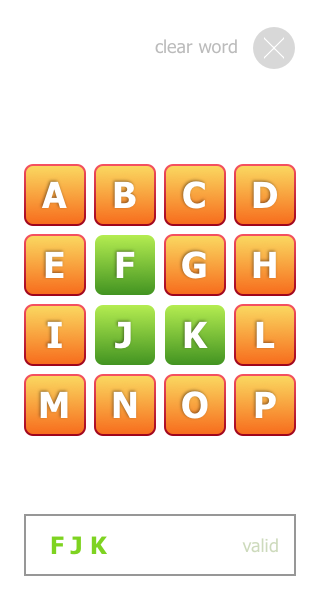
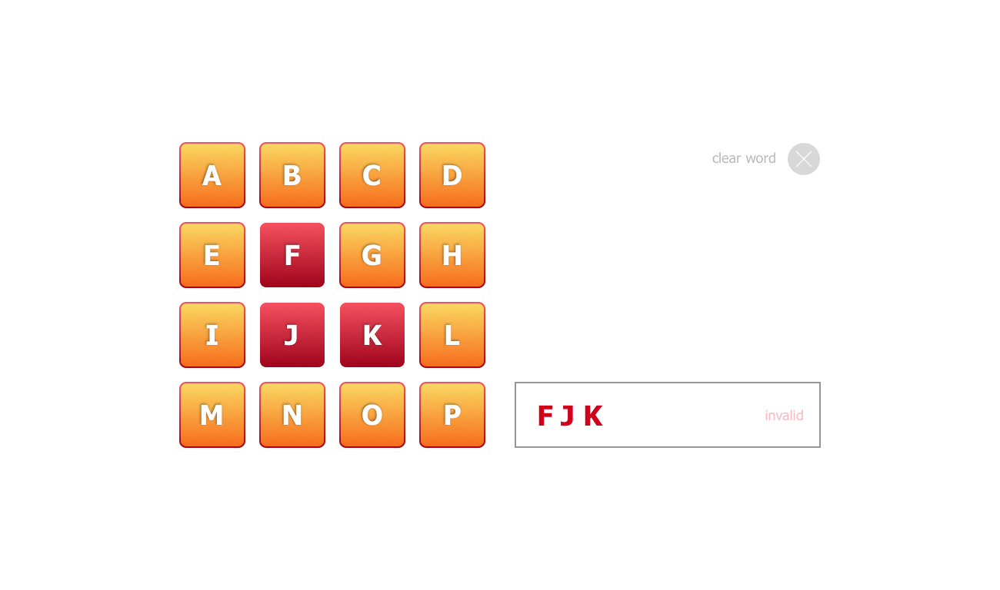

# Enara Health • Fullstack Interview • Letters game!

*Version 1.3*

## This is a coding challenge for applicants interested in joining Enara Health.

[Full job description](https://www.getonbrd.com/jobs/frontend-react-rn-developer-enara-health-sv-ny-scl-remote)

We ask you to *read this file completetly* **before** you begin working on your solution. 
There is a Q&A and an example section at the end of the file, which may help you to complete this challenge faster.

We sincerely thank you for your interest and your time.

Best, 
The Enara Health team!

## Create a React JS or React Native app

- You can use any boilerplate or start project. If you need help with this, let us know and we will share a quick-starter project promptly.
- Keep your code separated from the boilerplate, so it's easier to review your work.
- We prefer TypeScript or typed JavaScript.

### The app

- Our game will present a board with 16 tiles (4x4) in the center of the screen.
- Upon load, each tile should be randomly assigned letter (or letters should be read on load from a given json file: see [`test-board-1.json`](files/test-board-1.json) and [`test-board-2.json`](files/test-board-2.json)).
- The user can select tile by clicking/tapping them. 
	- **Extra points**: After the first letter, the user can only select neighbor tiles to the last tile selected.
- At the bottom of the board, display the word formed by the selected tiles.
	- **Extra points**: Validate if the word is contained in a [`dictionary.json`](files/dictionary.json) file. You can set up your board using the letters from our [secondary board file](files/test-board-2.json), which contains many words from the dictionary!
- Add a button `(x)` to reset the board, deselecting all tiles and clearing the word.

#### Example

In the following example, the initial board presents the content of the [test json file 1](files/test-board-1.json), and has no tile selected. There's no formed word either. The reset button is disabled.

Then, the user clicks the F tile, which gets selected. The formed word is now `F`. The reset button is now enabled.

The user selects the A tile by clicking it. The formed word is now `FA`. Finally, the user selects the B tile. The formed word is now `FAB`.

If the user clicks the reset button, the board is reset.

```
              ( )                 (x)                 (x)                 (x)
    A  B  C  D          A  B  C  D         [A] B  C  D         [A][B] C  D
    E  F  G  H          E [F] G  H          E [F] G  H          E [F] G  H
    I  J  K  L          I  J  K  L          I  J  K  L          I  J  K  L
    M  N  O  P          M  N  O  P          M  N  O  P          M  N  O  P
            
   [          ]        [ F        ]        [ FA       ]        [ FAB      ]
```

### Requirements

- Choose whatever would be easier/faster for you – React JS or React-Native.
- **Extra points**: Make sure you only let the user select neighbor tiles!
- Make it look like the following designs:
	- ReactJS only: Use *responsive* display for mobile and desktop.
	
	- Implement styles using exclusively CSS, not images.

        - Ignore "Valid" or "Invalid" part of the designs unless you go for the **extra points**!

	- Layour for mobile media:

		

	- Layout for desktop media (ReactJS only):

		
		
---

## Submitting your work 

Your deliverable should satisfy all these requirements:

- It should include *instructions on how to run* (installing dependencies, starting it, etc) – Avoid weird environment requirements.

- It should be submitted using one of the following alternatives:
    1. bitbucket.org or github.com repo.
    1. Upload a compressed file somewhere and send us the URL.
    - *Note: Do NOT include `node_modules` or any other files that will be auto-generated*.

---

## Frequently asked question

- Q: Can I use external libraries (npm)?
    - Of course you can!
    - However, if some functionality is very easy to implement, try to implement it yourself (i.e. Don't install a library to figure out if a number is odd/even).
    - Choosing when and what libraries will speak about your judgement.
- Q: This coding challenge is too long. Is it OK if I implement it partially?
    - Although we recognize this exercise may take some time, it does measure if you have the skills we need to work at Enara Health.
    - Submitting an incomplete solution is acceptable, specially if you explain the reasons. 
    - However, a complete solution will increase the likelihood of being selected, and it will save time during our in-person interview. 


## Thanks for your time!
The Enara Health team!
